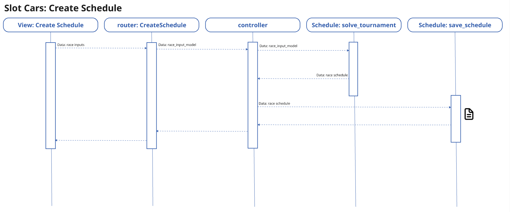

# 1: PROBLEM
A friend who enjoys [Scalextric slot car](https://uk.scalextric.com/) racing hosts race nights with friends and family. Since he is an avid racer - and former rally car driver - he has leg up on most other people attending his fun, yet competitive race nights. He is also concerned about equity, fairness, and ensuring his friends and family enjoy the time: he desires competitive and exciting, but fair time together. 

*He desires to ensure a sense of equity and fair play regardless of who is racing or which slot car they might race.*  
**He wants people to have fun and enjoy themselves racing Scalextric as he does**

# 2: SOLUTION VISION
Find an optimization model using Python libraries that might solve for the various parameters: cars, drivers, etc.

## 2.1: Use Cases and User Stories

1. UC: Create schedule
   - As a race event host, I want to create a fair, equitable race schedule so that every participant feels competitive and can enjoy themselves.
   - As a race event host, I want to export the schedule in a print-friendly format so that I can easily manage the race at runtime. 

## 2.2: Technical Solution: true optimization / constraint-satisfaction model. 
1. Specifications:
- 6 cars / slots per heat
- Drivers must use each car once
- Some heats may be partially filled
- We want minimum number of heats and minimum wasted slots
- Every pair must meet ≥ 1 and ≤ 2 times

2. **Solution:**
- In the technical approach section an optimizer-style solver using backtracking + pruning is describe. The model will:
  - Work for 6, 12, 15, 18, … drivers
  - Minimizes number of heats
  - Minimizes wasted slots
  - Allows partially-filled heats (not full 6 lanes)
  - Enforces:
    - each driver uses each car exactly once
    - max 6 drivers per heat
    - pair constraints: no pair meets more than twice
    - every pair meets at least once

## 2.3 Technical Approach with Claude Code
Leveraged Claude Code prompting to explore, evaluate, and solve the optimization mathmatics problem.
- Iterated through models and Python libraries
- [Claude solution in separate learning document](READNE_Technical_LLM_Solution.md) 

# 3:CODE STRUCTURE

## 3.1 Create Schedule
1. Key Steps
   1. Obtain parameters from User: HTML template view
      - Display a "processing icon" (not progress bar) to User until return message is available
   2. Parameters received at RESTful POST endpoint on schedule router: validated with input model
   3. Input model values passed to Controller
   4. Controller passes to create schedule
   5. Once schedule is created, schedule passed to export schedule to CSV
   6. Return message to User on HTML template
      - Remove the "processing icon"
      - Display the name of the file such that when the User clicks on it, the file can be downloaded
2. Sequence Diagram

                                                                                                                                                                            
## 3.2 Download Schedule
1. Key Steps
   1. User sees message that schedule is available: link to access the file
   2. User clicks on the link to download the file, activating RESTful GET on schedule router
   3. Router accesses file and returns to User as file download

## 3.3 Logging
1. Created logger to track application progress and errors
2. Instantiate and use as follows - also described in the /log-writer/logger.py file
```pytyhon
    #instantiate module level logger
    logger = get_logger(__name__)

    #use case: document process steps
    logger.info(f"Full schedule of heats successfully exported to: {heats_filename}")
    
    #use case: capture exceptions
    except Exception as e:
        logger.error(f"EXCEPTION OCCURRED: generating full schedule: {e}")
        return False
```

# 4: NEXT STEPS: To Dos: Enable user input, track logs, deploy solution for use

1. [x] Add logging: [DONE]
    1. [x] create a logging module to handle logs
    2. [x] define a custom log message format - DONE 
    3. [x] send log message to log_writer - DONE
    4. [x] Add logging to services
        1. [ ] create_race_schedule.py - to do
        2. [x] publish_schedule.py 
2. [ ] Incorporate FastAPI with an HTML Form, deployed to a cloud host
   - Objective: Make it easier for a user to access and provide the race parameters
   - Reasoning:
     1. Distribution is the dominant problem, not the UI. Both options produce roughly equivalent "fill in a form" experiences. The difference is how your friend gets
     the software running. 
     2. Codebase is already structured for it. controller() is a clean function that takes parameters and returns a result dict. Wrapping it in a FastAPI endpoint
      is minimal work. A Jinja2 template with 6 form fields is simpler than learning Tkinter geometry managers.
   - Planned approach:
     - [x] Add FastAPI framework: routers and views
     - [x] Add Pydantic model  for race inputs - ensure validation from Swagger
     - [x] Create CSV files and return success message
     - [ ] Add Jinja2 HTML form to receive parameters and post to schedule view
     - [ ] Add Form validation input parameters with sensible defaults 
     - [ ] Submit returns the CSVs as downloadable files (using StreamingResponse or FileResponse)
     - [ ] Deploy to FastAPI host

